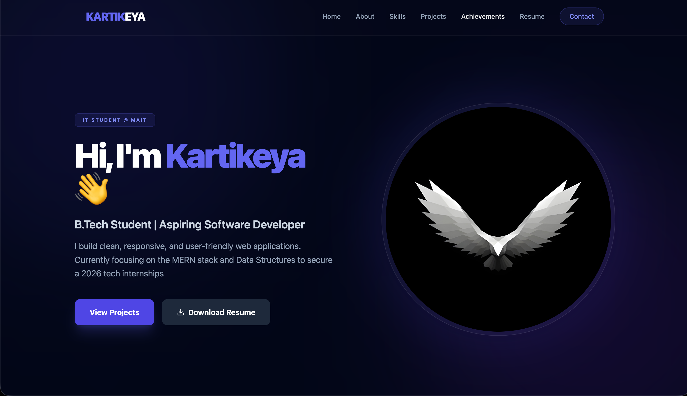

# Kartikeya | Personal Portfolio



> A modern, responsive personal portfolio website designed to showcase my skills, software development projects, and academic background as an IT student. Built with a focus on clean UI, performance, and accessibility.

## 🚀 Live Demo
**[View Live Portfolio](https://kartikeyarev.github.io/portfolio)**
*(Replace the link above with your actual GitHub Pages URL if different)*

---

## 🛠️ Tech Stack
This project is built using modern web technologies without heavy framework dependencies, ensuring fast load times and easy maintenance.

* **Frontend Structure:** 
* **Styling & UI:**  (Utility-first CSS)
* **Interactivity:**  (Vanilla JS)
* **Icons:** [Lucide Icons](https://lucide.dev/)
* **Form Handling:** [Formspree](https://formspree.io/)

---

## ✨ Key Features

* **🎨 Glassmorphism Design:** Features a modern, dark-themed UI with frosted glass effects (`backdrop-filter`) on navigation and cards.
* **📱 Fully Responsive:** Optimized for all devices, from mobile phones to large desktop screens. Includes a custom mobile hamburger menu.
* **⚡ Smooth Animations:**
    * Scroll-triggered reveal animations using `IntersectionObserver`.
    * Glowing pulse effects on profile elements.
    * Smooth scrolling navigation.
* **📄 Integrated Resume:** Direct download link for the updated CV.
* **contact Ready:** Functional contact form integrated with Formspree for direct email communication.

---

## 📂 Project Structure

```bash
Portfolio/
├── index.html        # Main HTML structure
├── style.css         # Custom styles & animations (Glassmorphism, Scrollbars)
├── script.js         # Logic for mobile menu & scroll animations
├── Resume.pdf        # Downloadable CV
├── image2.jpeg       # Profile asset
└── Readme.md         # Documentation